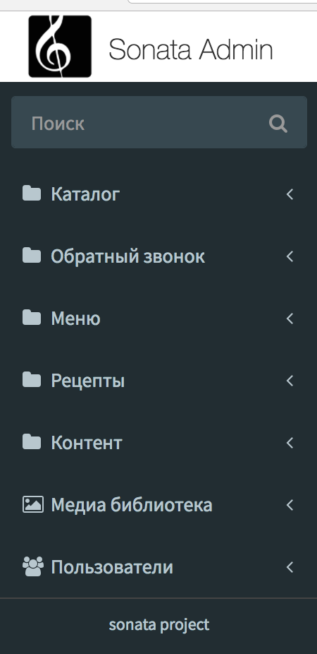
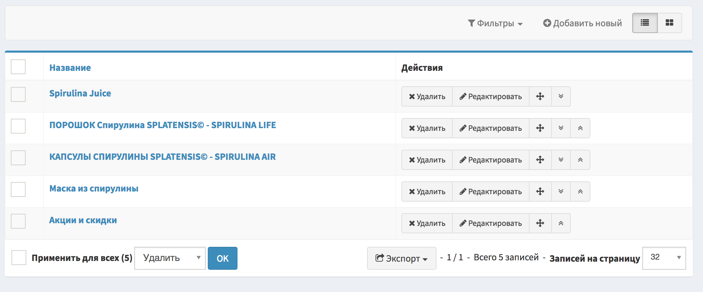

# Навигация

Осуществлять навигацию по Sonata Admin можно двумя способоами:

1) В левом меню:

 { width=200 }

2) В правом верхнем меню, при нажатии на кнопку [+]:

 { width=400 }
 
#Meta-трейт

Мета-трейт, это php-трейт, который при необходимости добавляет к классам сущности дополнительные поля для SEO:

- Мета заголовок - содержимое тега ```<title>``` на странице
- Мета описание - содержимое тега ```<meta name="description">``` на странице
- Мета ключевые слова - содержимое тега ```<meta name="keywords">``` на странице

#Медиа-компонент

[Компонент](http://dev.splatensis.ru/admin/media/media/list) для работы с медиа-файлами и привязки их к сущностям базы данных.

### Медиа

Имеет две ключевые метки:

- контекст осуществляет кастомизацию медиа под нужды привязываемой сущности (размер, транскодирование, CDN ...)
{ width=500 }  
- провайдер - в зависимости от выбранного провайдера применяет контекст:  
{ width=600 }

#### Поля:


##### Превью
- Размер
- Тип контента
- Защищенный URL - URL для просмотра пользователем с правом администрирования
- CDN (если используется) - дата последнего очищения кэша CDN, если не используется - дата последнего изменения
- reference - прямая ссылка на исходный файл, ниже  - список thumbnails согласно контекста. Картинки обрезаеются по масимально возможной ширине, то есть, если картинка имеет размер меньший, чем размер указанный в контексте, она останется неизменной.

##### Медиа
Список полей самой сущности БД:  

- Название - имя медиа в системе
- Включено - активность медиа-элемента
- Автор
- Очистить CDN - очистка кэша CDN
- Описание
- Copyright - авторское право
- Файл/Ссылка - загрузить новый медиа-файл

### Медиа-галерея

Предназначена для группировки сущностей медиа `одного контекста`, в противном случае пытается применить контекст ко всем выбранным элементам медиа.  


####Действия:

- Удалить - уалить медиа-элемент из галереи
- Добавить новый - добавление медиа-элемента в галерею
- Список - выбор элемента медиа из списка
- Добавить новый (в строке таблицы жлементов медиа) - загрузить новый элемент
- Включено - отключение медиа-элемента
- Позиция - "перетащить и бросить" за значок "=" для установки позиции элемента при выводе

#####`ВАЖНО! Все действия будут применены только после нажатия на кнопку "Сохранить"`

#### Списки медиа:
Имеют два режима отображения:  
- плитка  
{ width=600 }  
- список    
{ width=600 }  
```Для выбора элементов в любом из режимов достаточно нажать на ссылку элемента```  
{ width=300 }{ width=300 }

 
# Общие элементы таблиц-списков
 
  { width=600 }  
- Экспорт - скачать вывод таблицы в один из форматов (JSON, XML, CSV, XLS)
- Применить для всех - чекбокс для выбора всех элементов таблицы и их удаление при нажатии на кнопку "ОК"  
- Выбор элемента - удаление только этого елемента при нажатии на кнопку "OK"  
{ width=600 }  
- Фильтры - используют SQL-оператор LIKE для нечеткого поиска по базе данных
{ width=600 }    
- Расширенные фильтры:  
 { width=600 }  
 равен - точное совпадение слов, не содержит - вывод всех записей кроме этой, содержит (аналог обычного фильтра)

#Редактор

Используется редактор [CKeditor](https://ru.wikipedia.org/wiki/CKeditor).  
Интеграция с медиа-компонентом осуществляется через нажатие иконки "картины" в тулбаре редактора:
  
  
 
# Обратная связь

[Сбор данных](http://dev.splatensis.ru/admin/app/call/list) - отправленных из формы "Заказать обратный звонок"  
[Модерация комментариев](http://dev.splatensis.ru/admin/app/comments/list):  
{ width=800 }
 
# Каталог

Редактирование каталога находится в категории меню "Каталог"
 
### Категории
 
 [Категории](http://splatensis.ru/admin/app/category/list) - категории товаров каталога.
 
  { width=600 }
  
#### Поля:
  
  - Заголовок - название товара.
  - Алиас ЧПУ - алиас в URI, если поле null - генерируется транслитом по стандарту ISO9 из заголовка. 
   
#### Действия:

При работе со списком категорий каталога доступны элементы управления позицией категорий при выводе их в списках - поднять вверх, опустить вниз, "перетащить":  

 { width=620 }
  
### Товары
 
 [Товары](http://dev.splatensis.ru/admin/app/product/list) - товары каталога
 
  { width=600 }
  
#### Поля:

- Категория - выбор категории товара
- Алиас ЧПУ - алиас в URI, если поле null - генерируется транслитом по стандарту ISO9 из заголовка. 
- Галлерея (неграмотные переводчики сонаты) - гелерея картинок на странице товара:
  { width=600 }
- Обложка - картинка товара в списках:       
  { width=300 } 
  
- Описание - описание товара
- Короткое навание - название для вывода в списках
  { width=600 } 
- Количество - количество на складе
- Количество в упаковке - для вывода в списках и в детальной информации
- Акция - добавляет значок "Акция" в списках товара
- Бесплатная доставка - добавляет значок "Доставка" в списках товара
- Скидка добавляет значок "Скидка" в списках товара       
  { width=300 } 
  
#### Контекст медиа:
- Имя контекста: products
- Размеры:
    * smaller (макс ширина 30 пикс.), используется для вывода thumbnail в галерее товара.
    * big (макс ширина 300 пикс.), используется как текущая картинка в галерее товара
   { width=600 }
   
```Для наилучшего отображения рекомендуется использовать пропорции 222x335```  

#Сортировка товара внутри категории
  Сортировка осуществляется внутри [категории](http://dev.splatensis.ru/admin/app/category/3/edit).  
  Для того, чтобы изменить позицию товара внутри категории, необходимо:  
- выбрать вкладку "Товары"  
{ width=800 };  
- переместить строку товара на нужную позицию посредством `drag&drop` за символ `=`;  
- нажать сохранить.
    
#Заказы
[Заказы](http://dev.splatensis.ru/admin/app/productorder/list) - список заказов.
Обработка заказа представлена на анимации:    
   { width=1000 }  

## Поля:

- Имя - имя клиента
- Номер телефона - номер телефона для связи
- E-mail
- Детали заказа - таблица выбранных клиентов товаров с указанием количества   
  { width=600 } 
- Подписка на рассылки - согласие пользователя на участие в рассылках на электронную почту
- Адрес, квартира, индекс - данные для доставки
- Тип оплаты - способ оплаты:
    * Наличные
    * Робокасса
    * Картой
- Общая сумма - сумма для выставления счета
- Сумма скидки
- Статусы заказа:  
    * Создана - не обработанная заявка
    * Оплачена - оплачена и ожидает доставки
    * Завершена - доставлена и полачена
    * Отклонена - отклонена администратором
- Комментарий администратора - комментарий менеджера принявшего заявку

# Меню
    
   [Меню](http://dev.splatensis.ru/admin/app/menutype/list) - список доступных к редактированию типов меню.  
   { width=600 }
    
#### Поля
  
- Название - наименование типа меню
- Позиция - тип позиции меню, бывает 4 типов: вверху (главное меню), слева (меню каталога), футер (слева/справа) - меню футера. При количестве созданных типов меню больше двух, во фронтенд выводится первое созданное по времени меню. Для того, чтобы вывести созданный тип, необходимо удалить остальные меню этого типа.
- Пункты меню (см. раздел пункты меню)

#Пункты меню

Редактирование пунктов меню доступно внутри [редактирования](http://dev.splatensis.ru/admin/app/menutype/1/edit) типа меню.

#### Поля
  
- Название - название пункта меню
- Роут (URL) - URL старницы относительно домена (без имени домена и протокола).
- Позиция - позиция сортировки при выводе, в списке пунктов можно "перетаскивать и бросать" пункты меню за значок "=".
- Родитель - родитеслький пункт меню для вывода вложенного меню, сам родитель при это становится неактивным и играет роль show/hide кнопки.

#### Действия

- Добавить новый  
- Удалить  
{ width=600 } 

#####`ВАЖНО! Все действия будут применены только после нажатия на кнопку "Сохранить"`

# Рецепты

### Категории рецептов
[Категории рецептов](http://dev.splatensis.ru/admin/app/recipecatalog/list) - список категорий рецептов
{ width=600 } 
 
#### Поля:

- Заголовок - название категории рецепта
- Описание - описание категории рецепта
- Обложка - обложка в списках
- Активен - активность рецепта

### Рецепт

[Рецепт](http://dev.splatensis.ru/admin/app/recipe/list) - список рецептов категории  
{ width=600 } 

#### Поля:

- Заголовок - название рецепта
- Категория - категория рецепта
- Краткое описание - вывод информации при ховер-эффекте на рецепт:  
{ width=200 } 
- Описание - описание рецепта
- Шаги - шаги рецепта, отображающиеся на странице рецепта:  
{ width=400 } 
- Обложка - картинка для отображения в списках

# Контент

Раздел для управления текстовыми страницами и блоками

### Страницы

#### Поля
- Заголовок - название, выводится на странице в заголовке h1
- Алиас ЧПУ - алиас в URI, если поле null - генерируется транслитом по стандарту ISO9 из заголовка.
- Контент - html-код страницы
 
#####`ВАЖНО! При работе с редактором в статичных страницах желательно использовать режим источника`:  
{ width=600 }

### Блог

#### Поля

- Заголовок - название, выводится на странице в заголовке h1
- Текст - текст записи блога
- Обложка - медиа-элемент
- Короткое описание - описание записи блога для вывода в списках при ховер-эффекте
- Дата - дата публикации

#####`URL блога генерируется транслитом по стандарту ISO9 из заголовка`:

### Блоки текста

Блоки текста предназначены для вывода текста в каталогах первого уровня (списка категорий сущностей) имеют две позиции:  
- перед контетом (сразу после тега h1)
- после контента

#### Поля

- Позиция (после/перед контентом)
- Страница каталога первого уровня (каталог/блог/рецепты)
- Контент - текст блока

# Пользователи и группы

Интерфейс [ACL Symfony](https://symfony.com/doc/current/bundles/SonataAdminBundle/reference/security.html) - является аналогом реализации ACL в *nix системах.

